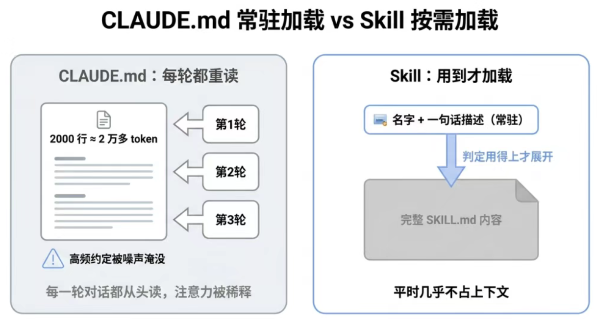
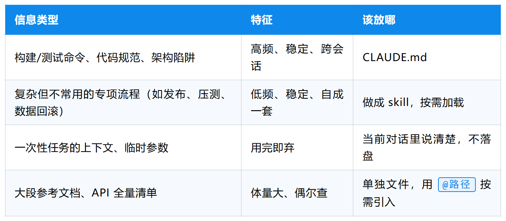
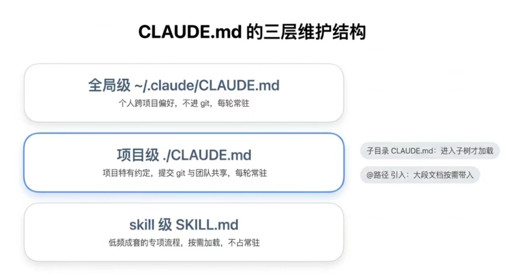

Claude Code专栏
https://kcnxjau9hxy4.feishu.cn/wiki/XiafwStaJiPFWSkwhbJc7ruSntc

# 1. 概述

## 1.1 什么是ClaudeCode
Claude Code 是由 Anthropic 公司推出的 AI 驱动命令行编程工具，通过自然语言对话完成代码编写、调试、重构等开发任务。它不是简单的代码补全工具，而是一个能够**理解整个代码库、跨文件操作、自主规划执行步骤**的智能代理。
**核心能力**
- 代码读写	读取整个代码库，编辑多文件
- 命令执行	运行终端命令、构建项目、启动服务
- 工具集成	Git、MCP 扩展、浏览器、文件系统
- 主动规划	任务拆解、步骤执行、结果验证
- 持久记忆	跨会话记住项目规则和上下文

## 1.2 核心概念

**1）上下文窗口**
可将其理解为 Claude 的临时工作记忆。它能容纳海量信息，但无法一次性承载全部内容。这也是其自主执行能力的核心原理：无需把完整代码库全部载入记忆，就能通过合理策略在代码库中精准检索所需答案。
**2）默认请求许可**
Claude Code 在执行指令、修改代码文件前，都会主动向你发起确认请求。无论你是全程手动把控，还是交由工具自主运行，始终由你掌握全部操作主导权。

# 2. 工作原理
核心运行逻辑，核心是一个递归的 Agentic Loop。
## 2.1 核心运行： Agentic Loop​
- **输入指令**：你向 Claude Code 输入需求提示词。​
- **搜集所需信息**：它结合大模型分析需求，调取完成任务必备相关内容，模型会返回文本内容或可执行的工具调用指令。​
- **执行实际操作**：依据指令做出对应行为，例如修改代码文件、运行终端命令等。​
- **结果核验判定**：自动校验执行结果，判断是否达成你最初提出的需求目标。​
- **闭环循环**​ 
	- 结果达标：任务结束，等待你的下一条指令​
	- 结果未达标：重新进入循环流程，反复执行操作、核验，直至任务完成且结果无误​​
**人工干预权限**： 整个运行过程中，你随时可以补充信息、中断进程、引导模型思路，把控最终任务走向。

## 2.2 上下文窗口机制​
上下文窗口决定了它能留存、回看的内容上限，包含对话记录、代码文件内容、命令执行日志等所有信息。
一旦达到存储上限，Claude Code 会 自动压缩整理会话内容 ：剔除无用信息、精简总结冗余内容，主动释放上下文空间，保证程序正常运行。

## 2.3 核心支柱：工具调用能力
- ​普通 AI 助手仅支持纯文字输入输出，无中间实操能力；而工具调用是智能Agent的核心根基。​
- 借助各类内置工具，Claude Code 可自主判断时机调用功能推进任务，例如读取文件、联网检索等。​ 
- 还支持语义检索，精准判断调用对应工具，并获取工具执行结果。​ ​

## 2.4 权限运行模式​
默认状态下，修改文件、运行终端命令**必须提前征得你的手动确认** ，按下 Shift+Tab 可快速切换运行模式：​
  - 自动编辑模式 ：自动同意文件修改操作，运行命令依旧需要手动授权​
  - 规划模式 ：仅使用只读类工具，先梳理完整执行方案，再正式开始执行任务​
**重要提醒**： 切勿随意关闭权限校验、放任其自由执行命令，一旦出现逻辑错误，极易引发难以察觉的代码故障与运行风险。

# 3. CLAUDE.md 文件
## 3.1 主要作用
是 Claude Code 最实用的功能之一，相当于给项目搭建 长期专属记忆。
- ​项目内没有该文件时，每次启动 Claude Code 都要从零开始：重新遍历代码库、梳理项目依赖、梳理已完成功能，还容易自行主观猜测项目规范，很难精准对齐你的开发思路。
- claude.md 是放在 项目根目录 的 Markdown 文件，每次开启会话都会被自动读取，等同于项目专属的开发指引手册。​ 
- 文件内的所有内容，会自动追加到你的每一条提示词中，潜移默化统一开发规范。​
- 快捷生成指令：输入 /init ，即可让 Claude 自动根据当前项目结构生成对应的 claude.md 文件。

## 3.2 文件内容示例
以 Next.js 15 项目为例，可写入这类统一规则：​ 
- 技术栈：采用 App Router、Tailwind CSS、Drizzle ORM​ 
- 运行规范：本地启动开发服务、执行测试、代码格式化​ 
- 代码风格：缩进使用 2 个空格，优先使用具名导出​ 
- 目录规范：所有接口路由统一放在 app/api 目录​ 
- 开发原则：优先使用服务端动作，尽量少用传统接口路由​ 
写入后，你让它新建 React 组件、编写业务代码时，会自动沿用这套规范，无需反复重复叮嘱。

## 3.3 记忆文件层级划分​
**项目级 claude.md**​ 
- 存放于项目根目录，跟随项目版本管理同步提交， 团队全员共用 ，统一团队项目开发标准。​ 
**用户级 claude.md​** 
- 存放在个人配置文件夹中，仅对本人生效， 全局所有项目通用 。可填写个人编码习惯、注释风格、固定开发偏好等私人设定。

## 3.4 使用技巧​
- **固定开发习惯** ：若你需要强制统一写法（如优先用服务端动作），可直接让 Claude 将该规则存入记忆，后续打开项目自动生效。​ 
- **引用项目文档** ：想让它读取项目内指定文档作为参考，直接用 @+文件路径 即可快速引用。​
- **精简编写原则**：新项目初期建议先不创建该文件，在使用过程中记录需要反复纠正的开发要求，最后再整理写入，保证文件简洁精炼，只留存必要规则。

## 3.5 特别分析
参考：
https://mp.weixin.qq.com/s/lpnj98fYBk1cf_TCFPwxYg

**问题：**
Claude Code 用了半年，你的 CLAUDE.md 现在多少行了？"两千多行吧，"他答得挺顺，"项目约定、代码规范、踩过的坑，想到什么往里加。"
**分析：**
CLAUDE.md 每次会话自动加载进上下文，你写多少，模型每轮就读多少。两千行两万多 token，一次会话来回几十轮，光重读这一个文件就是几十万 token。更糟的是，真正高频用到的可能就二三十行，剩下全是噪声，把那二三十行也淹了。
CLAUDE.md 不是写出来的，是维护出来的。
**1）CLAUDE.md 不是越全越好，它是每轮都要付的"常驻成本"，在每一轮对话里重复付费的。**
CLAUDE.md 是**会话启动时就自动注入上下文**的，它不是按需读取，是常驻。
这跟 skill 是两套完全不同的加载逻辑。skill（SKILL.md）走的是渐进式按需加载：默认只把名字和一句话描述放进上下文，模型判断这次任务用得上，才把完整内容读进来。一个不常用的复杂流程放进 skill，不用的时候它几乎不占上下文；同样的内容塞进 CLAUDE.md，哪怕一个月用不上一次，也得每轮陪读。
CLAUDE.md太大，直接导致① token大量消耗。② 注意力被稀释。模型的注意力是有限的，把二三十条真正高频的硬约束，和一千多行"某次调试随手记的临时笔记"混在一起，那二三十条就被埋了。

**2）什么才该进 CLAUDE.md：高频、稳定、跨会话**
一条信息该不该进 CLAUDE.md，看三个条件，三个都满足才进：
**高频。** 这条信息是不是几乎每次会话都会用到。比如项目的构建命令、测试怎么跑、代码风格约定，这些基本每次都碰得到，进。一个季度才用一次的发布流程，不进。
**稳定。** 这条信息是不是长期不变。项目的目录结构约定、技术栈选型，半年都不会动，进。当前正在调的某个 bug、这周的临时分支策略，下周就过时了，不进，写进去就是给未来的自己埋雷。
**跨会话。** 这条信息是不是换个会话还需要。架构上的"反直觉陷阱"，比如"这个服务看着是无状态的，其实依赖一个全局缓存，改它要小心"，这种每个新会话都得知道，进。某次对话里临时确定的一个参数，这次说清楚就行，不进。
三个条件像一个漏斗，能同时穿过的东西其实不多。我自己维护的项目级 CLAUDE.md，绝大多数控制在一百行出头，再多就要警惕了。

**3）分层维护：项目级、全局级、skill 级各管一段**
**全局级，`~/.claude/CLAUDE.md`。** 这是你个人的、跨所有项目的偏好。比如"回答用中文""提交信息别写废话""默认用 pytest 不用 unittest"。它只在你这台机器上生效，不进任何项目的 git。放这层的判断标准是：这条偏好换个项目还成立吗？成立，就该上提到全局，别在每个项目的 CLAUDE.md 里抄一遍。

**项目级，项目根目录的 `./CLAUDE.md`。** 这是这个项目特有的、要跟团队共享的约定。它进 git，团队每个人拉下来都生效。构建命令、目录约定、这个项目特有的架构陷阱，放这层。判断标准反过来：这条只对这个项目成立、且队友也需要知道吗？是，就放项目级并提交。

**skill 级，`SKILL.md`。** 前面说的那些低频但成套的专项流程，放这层，按需加载，不占常驻上下文。

这三层之外还有两个常用的补充手段。一个是**子目录 CLAUDE.md**：大仓库里某个子模块有自己特殊的约定，可以在那个子目录单独放一份，只有在那个子树里干活时才加载，不污染主上下文。另一个是 **`@路径` 引入**：CLAUDE.md 里可以用 `@docs/architecture.md` 这种写法把外部文件按需带进来，既保持主文件干净，又能在需要时引用大块内容。

**4）定期精简：什么信号说明它该瘦身了**
**信号一，行数越界。** 项目级 CLAUDE.md 超过两三百行，先别急着加新的，回头看看有没有过时的。经验阈值是项目级一百多行、全局级几十行，超了就该警惕。
**信号二，模型反复忽略某条指令。** 这是个特别强的信号，前面那个备份的 case 就是。如果你发现某条明明写了的约定，模型老是不遵守，先别怪模型，大概率是它被埋太深了。要么把它提到最前面的硬约束区，要么说明它已经不重要了可以删。
**信号三，出现"上次那个 bug""临时先这样"这类字眼。** 这些都是会过时的临时信息，混进了常驻文件。定期搜一遍这类词，基本都能清掉一批。
**信号四，同一件事写了两遍。** 文件长了就容易重复表达，重复的内容不光占地方，还可能前后矛盾，让模型无所适从。

精简的手法也简单：高频硬约束往顶部提，单独成段、显眼；低频成套的流程下沉成 skill；过时的、临时的直接删；大段文档挪出去用 `@` 引。精简不是一次性的活，大概每两三周会扫一遍主力项目的 CLAUDE.md，每次都能删掉三五十行，删完模型的表现反而更稳。

---
