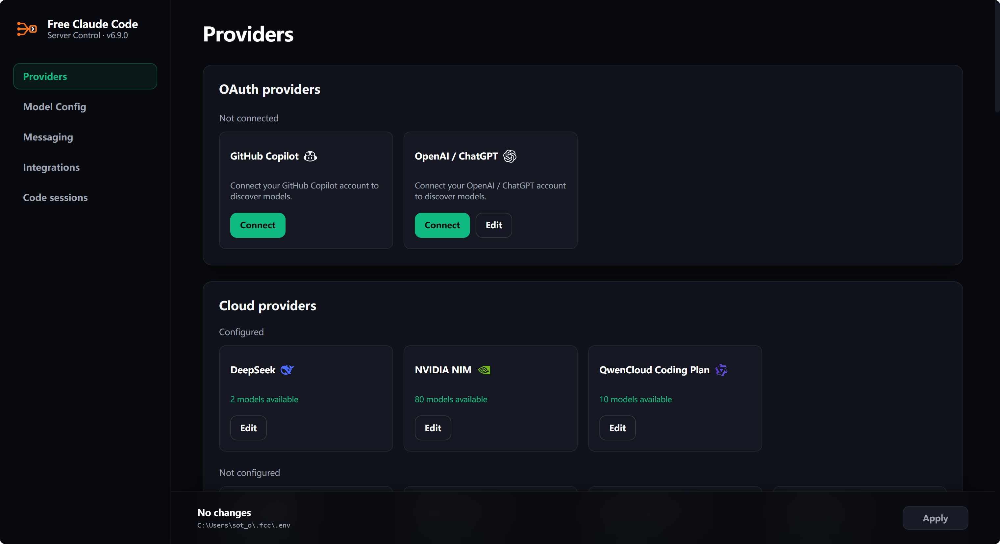
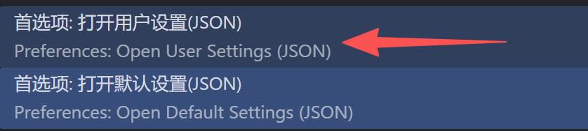
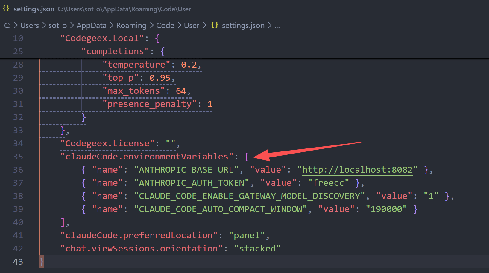
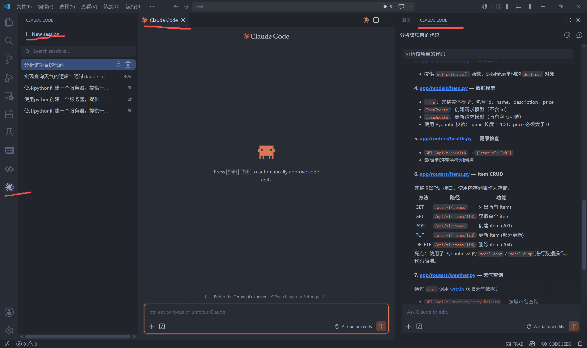

## 1. 概述
**GitHub：**[Alishahryar1/free-claude-code: Use Claude Code, Codex, VSCode, Pi, and OpenCode (and 6 other harnesses) for free (1.3B+ free tokens) from your terminal, app, IDE, or phone, and now from the browser with native browser sessions (multi-harness + multi-model) like OpenClaw (voice supported + ToS friendly)](https://github.com/Alishahryar1/free-claude-code)

## 2. 安装
参考官方说明，在Windows环境下，采用脚本安装：
```Shell
& ([scriptblock]::Create((irm "https://raw.githubusercontent.com/Alishahryar1/free-claude-code/main/scripts/install.ps1")))
```
在安装的过程中，会提示ClaudeCode、Codex、Pi等系统的安装及检测，根据需求进行确认即可。
新的版本安装完毕，可以通过指令查看：
```Shell
fcc-server --version
# free-claude-code 6.9.0
```
在windows11系统中，会生成快捷方式，点击即可在后台运行，可以在托盘区查看状态或者退出。
安装完毕后，Admin页面会占用8082端口：
[Free Claude Code Admin](http://127.0.0.1:8082/admin)


安装完毕后的文件在 C:\Users\xxxx\.local\bin 目录下。

## 3. 使用
### 3.1 模型配置
在Admin页面中进行模型的配置。free-claude-code 采用**三档模型分级**架构，对应 Claude Code 原生的 Opus、Sonnet、Haiku 三层模型体系，分别处理不同复杂度的任务：
- **Opus**：处理复杂任务（如大型重构、架构设计）
- **Sonnet**：日常主力编码任务
- **Haiku**：处理简单琐碎任务（快速问答）
- **兜底模型**：当上述三档未匹配时的默认选项
这种设计类似像给车装“混合动力”一样，重负载走高质量免费模型，轻负载走本地小模型，实现成本与性能的最优平衡。
一般推荐：NVIDIA NIM、DeepSeek 和 本地Ollama 配合：
```Shell
# Model Routing
MODEL=deepseek/deepseek-v4-flash
MODEL_OPUS=deepseek/deepseek-v4-pro
MODEL_SONNET=deepseek/deepseek-v4-flash
MODEL_HAIKU=ollama/glm-4.7-flash:latest

# Thinking
ENABLE_MODEL_THINKING=true
ENABLE_OPUS_THINKING=
ENABLE_SONNET_THINKING=
ENABLE_HAIKU_THINKING=
```
因为 NV NIM的访问速度确实有点慢，改为 DeepSeek 和 Ollama组合。

### 3.2 在VSCode插件中配置
在VSCode中搜索并安装 **Claude Code for VS Code**，并确保 fcc-server 已启动。
通过 settings.json 配置：
1）按 `Ctrl+Shift+P`（Mac 是 `Cmd+Shift+P`）打开命令面板。
2）输入 `Preferences: Open User Settings (JSON)` 并回车，不要打开默认设置（是只读的，无法编辑）。

3）在打开的编辑页面中，添加如下配置：

**配置说明：**
- `ANTHROPIC_BASE_URL`：指向本地代理地址（默认 `http://localhost:8082`）
- `ANTHROPIC_AUTH_TOKEN`：认证令牌，必须与 `.env` 文件中的 ANTHROPIC_AUTH_TOKEN 值一致（默认 `freecc`）
- `CLAUDE_CODE_ENABLE_GATEWAY_MODEL_DISCOVERY`：启用网关模型发现功能，让 VS Code 能识别代理暴露的模型列表
4）重启VSCode即可，也可以通过 **重载 VS Code 窗口**（按 `Ctrl+Shift+P` → 输入 `Developer: Reload Window` → 回车）即可生效。
5）在VSCode中使用 ClaudeCode


## 4. 更新及卸载
### 4.1 Update
新的版本，已经提供了对应的脚本进行处理。
Stop all running FCC commands, then run:
```Shell
fcc-update
```
If FCC is already up to date, the command stops without running the installer. Otherwise, it shows the installed and available versions before updating. If the version check fails, retry the command.
To reinstall FCC or change optional components while already up to date, run the [installer](https://github.com/Alishahryar1/free-claude-code#install) directly.
### 4.2 Uninstall
Stop every running FCC command before uninstalling.
**Removes**
- Free Claude Code, including its desktop launcher and commands
- `~/.fcc/`
**Keeps**
- uv and Python
- Your coding agents and RTK
macOS/Linux:
```shell
curl -fsSL "https://raw.githubusercontent.com/Alishahryar1/free-claude-code/main/scripts/uninstall.sh" | sh
```
Windows PowerShell:
```powershell
& ([scriptblock]::Create((irm "https://raw.githubusercontent.com/Alishahryar1/free-claude-code/main/scripts/uninstall.ps1")))
```

## 5. 问题
**1）VSCode中的Claude无法使用**
问题描述：fcc-server已启动，在VSCode中的ClaudeCode无法使用。
原因：fcc-server服务占用的本地端口为8082，在本地docker中调试的一个服务刚好占用了**8082**，导致http://localhost:8082 服务失效。

**2）与CC-Switch的混用问题**
问题描述：在VSCode中使用时，突然提示aliyun账号的费用不够，请求失败。
原因：在vscode中配置的是直接使用fcc代理，但因为本地在cc-switch中打开了claude配置，导致在 .claude 目录下的 settings.json 中出现了 env 模型配置，直接覆盖了fcc的设置，刚好我使用的是deepseek-v4-flash 模型，在阿里云百炼平台也存在，这样VSCode中的claude使用，直接走的是阿里云百炼平台，扣费也是这样。在fcc中配置的DS平台的key相当于没用。
在使用fcc时，所有的claude配置在 .fcc 目录下的 .env 文件中。这样在 .claude 目录下的 settings.json 直接设置为 {} 即可。
博客：[使用VSCode + ClaudeCode碰到的配置冲突问题-CSDN博客](https://blog.csdn.net/james506/article/details/164152658)


---
