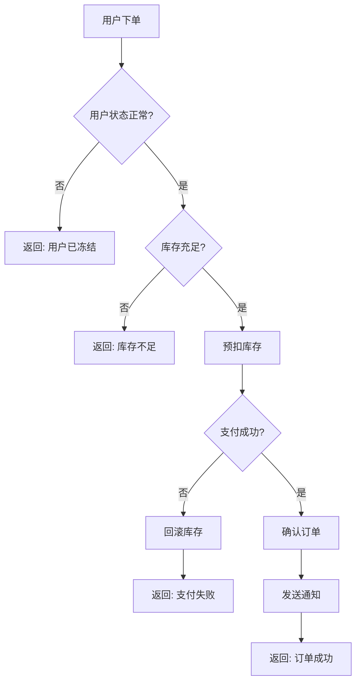

要让 AI 编程工具（如 Cursor、Windsurf、GitHub Copilot 等）更好地理解程序逻辑流程，**最佳实践是"结构化文字为主，辅助以 Mermaid 流程图"**，而非纯文字或纯图片。

## 推荐方案：结构化文字 + Mermaid 流程图

### 1. 结构化文字描述（核心）

使用**伪代码风格的分层描述**，明确以下要素：

| 要素        | 说明               | 示例                                        |
| --------- | ---------------- | ----------------------------------------- |
| **输入/输出** | 函数签名、数据类型        | `process_order(order_id: str) -> Receipt` |
| **步骤序列**  | 用编号或缩进表示执行顺序     | `1. 验证订单 → 2. 扣减库存 → 3. 生成收据`             |
| **条件分支**  | 明确 if/else 的判定条件 | `if 库存不足: 触发补货流程`                         |
| **循环/递归** | 标注终止条件           | `while 队列非空: 处理下一个任务`                     |
| **错误处理**  | 异常路径和回滚逻辑        | `若支付失败: 释放库存，返回错误`                        |

**示例：**
```text
函数: 用户下单流程
├── 输入: user_id, product_id, quantity
├── 步骤1: 验证用户状态 (if 用户被冻结 → 返回错误)
├── 步骤2: 查询库存 (if 库存 < quantity → 返回"库存不足")
├── 步骤3: 预扣库存 (原子操作)
│   └── 失败 → 返回"并发冲突，请重试"
├── 步骤4: 创建支付订单 (异步调用支付网关)
│   ├── 成功 → 步骤5
│   └── 失败 → 回滚库存，返回错误
├── 步骤5: 确认订单，发送通知
└── 输出: Order 对象
```

### 2. Mermaid 流程图（辅助理解）

AI 编程工具支持 Mermaid 语法，可直接渲染为流程图，**比截图/图片更优**：




## 实用模板（可直接套用）

当你需要描述一个复杂逻辑时，按这个结构组织：

```
【业务场景】一句话说明要解决什么问题

【前置条件】运行此流程前必须满足的状态

【主流程】（编号步骤）
1. ...
2. ...
3. ...

【分支逻辑】（表格或子流程）
- 条件X → 路径A
- 条件Y → 路径B

【异常处理】
- 错误类型1 → 处理方式
- 错误类型2 → 回滚/补偿操作

【后置状态】流程结束后的系统状态

【Mermaid 图】（可选，用于可视化验证）
```


---