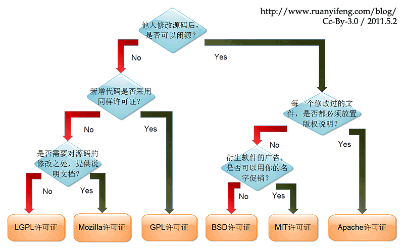

世界上的开源许可证，大概有[上百种](http://www.gnu.org/licenses/license-list.html)。很少有人搞得清楚它们的区别。即使在最流行的六种----[GPL](http://www.gnu.org/licenses/gpl.html)、[BSD](http://en.wikipedia.org/wiki/BSD_licenses)、[MIT](http://en.wikipedia.org/wiki/MIT_License)、[Mozilla](http://www.mozilla.org/MPL/)、[Apache](http://www.apache.org/licenses/LICENSE-2.0)和[LGPL](http://www.gnu.org/copyleft/lesser.html)----之中做选择，也很复杂。

乌克兰程序员[Paul Bagwell](http://pbagwl.com/post/5078147450/description-of-popular-software-licenses)，画了一张分析图，说明应该怎么选择。这是我见过的最简单的讲解，只用两分钟，你就能搞清楚这六种许可证之间的最大区别。

下面是我制作的中文版，请点击看大图。  

  

一、Apache License Version 2.0

https://www.cnblogs.com/Renyi-Fan/p/8148658.html

Apache 2.0 开源协议的核心内容是以保护和尊重原作者的著作权为主要目的。对使用，复制，修改，商用不做过多限制，但必须包含原著的License信息。

  

公司或项目在使用 Apache License Version 2.0 授权的开源软件时，不能隐瞒、删除甚至修改原著的著作权信息。你基于该开源软件发布的衍生作品所产生的任何法律问题与其他的贡献者无关。

  

因为开发，会用到框架，用到别人写的jar包，所以你需要知道你有没有侵犯到别人的专利。所以就有了这些个协议的问题。

比如说Apache License, Version 2.0，就是你用他的东西开发出来的程序可以商用为你赚钱，而不会涉及到侵犯专利，但是你要在程序里面注明你用了apache的代码，也就是你的代码里面要带上license。

  

Apache Licence是著名的非盈利开源组织Apache采用的协议。该协议和BSD类似，同样鼓励代码共享和尊重原作者的著作权，同样允许代码修改，再发布（作为开源或商业软件）。需要满足的条件也和BSD类似：

  

需要给代码的用户一份Apache Licence

如果你修改了代码，需要在被修改的文件中说明。

在延伸的代码中（修改和有源代码衍生的代码中）需要带有原来代码中的协议，商标，专利声明和其他原来作者规定需要包含的说明。

如果再发布的产品中包含一个Notice文件，则在Notice文件中需要带有Apache Licence。你可以在Notice中增加自己的许可，但不可以表现为对Apache Licence构成更改。

Apache Licence也是对商业应用友好的许可。使用者也可以在需要的时候修改代码来满足需要并作为开源或商业产品发布/销售

  

  

  

---

